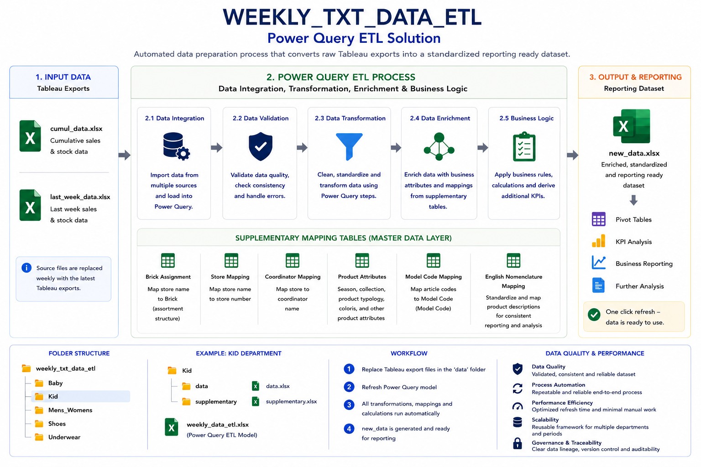

# retail_sales_data_etl_automation
Power Query ETL automation in Excel built to transform raw retail sales exports into reporting ready datasets for weekly business reporting.

## 1. 🎯 Business Problem

Many organizations  still rely on manual, Excel-based processes to prepare data for reporting. Typically, this involves VLOOKUP-based lookups, multiple source files, and repetitive, manual data preparation before every reporting cycle. As data volumes grow, this approach becomes increasingly difficult to maintain, more error-prone, and heavily dependent on individual knowledge. Working with hundreds of thousands of rows using VLOOKUP often results in slow performance and Excel instability, while repetitive data preparation becomes monotonous and time-consuming. Consequently, tasks that could be automated and managed by a single person are frequently performed manually by multiple employees. The Textile (TXT) Department, where I currently work with data, is a practical example of these challenges. Every Monday, sales data from multiple exports had to be consolidated, validated, and enriched with supplementary business data before reporting deadlines. To eliminate these manual bottlenecks, I developed a reusable Power Query ETL solution that automated the entire data preparation process, standardized transformation logic, and produced a reporting-ready dataset with a single refresh. The solution was designed to be easily adapted and reused across multiple retail departments.

## 2.💡 Solution Overview

The solution is a centralized Power Query ETL framework built within Excel 2013, acting as a data preparation layer between raw sales exports and the final reporting process. All transformation logic — previously scattered across hundreds of VLOOKUPs and manual mappings — was consolidated into a single automated workflow. Users only need to replace the latest source files and refresh the model. During refresh, the process automatically validates, transforms, and enriches the data using supplementary datasets, including store information, coordinator assignments, product hierarchies, seasonal collections, brick classifications, model mappings, and other business attributes. The output is a standardized, reporting-ready dataset that can be used immediately for operational reporting, KPI analysis, and business decision-making.

## 3. 🛠 Tools & Technologies

### Excel + Power Query

The original ETL workflow was designed and implemented in a retail environment using **Excel 2013**, the version provided by the company's IT license at the time, together with the Power Query add-in. Power Query was not widely adopted within the organization at that point, and most data preparation relied on manual Excel formulas such as VLOOKUP and repetitive copy-paste operations.
For this portfolio project, the solution has been recreated in **Microsoft Office Professional 2021** using an anonymized dataset that closely reflects the structure and business logic of the original process. The ETL workflow, transformation logic, and automation principles remain unchanged.
Note: In **Excel 2010 and 2013**, **Power Query** is available as a free Microsoft add-in. Starting with **Excel 2016**, it is built directly into Excel as Get & Transform Data, so no separate installation is required.

## 4.🏗️ Architecture Overview

## 4.🔄 ETL Workflow

